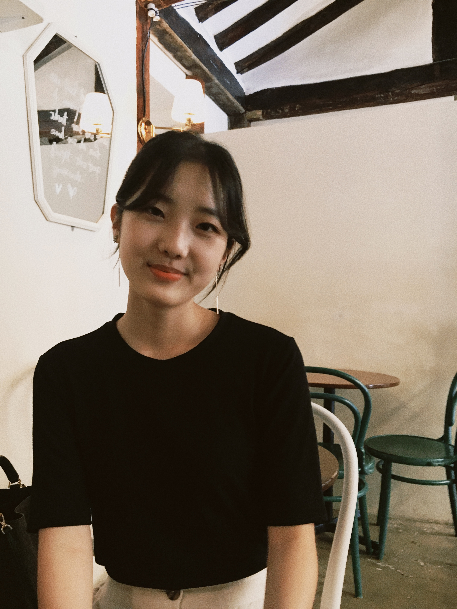

### Aspiring Data Scientist and Life Science Consultant

I am currently a Master’s student in Biostatistics at Columbia University with a strong foundation in biology and pharmaceutical industry experience. My expertise spans the drug pipeline, public health research, and data analysis, where I leverage Python, R, and SQL to generate actionable insights for health and consulting. 

Growing up as a South Korean across three states in Mexico, I witnessed the challenges of accessing credible medical services and products, which inspired my commitment to advancing high-quality healthcare solutions globally. Driven by this mission, I actively pursue opportunities to broaden my impact, continuously aligning my career path with my goal to contribute meaningfully to the field.